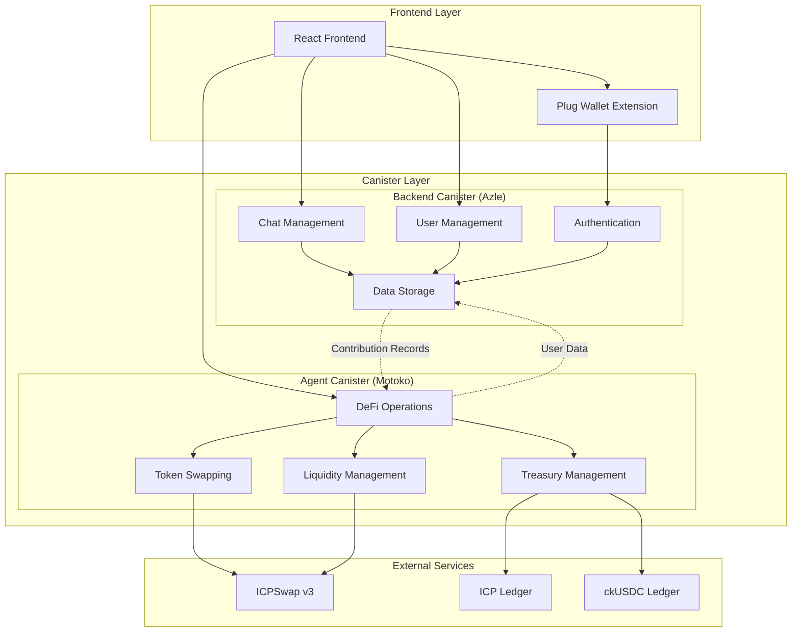
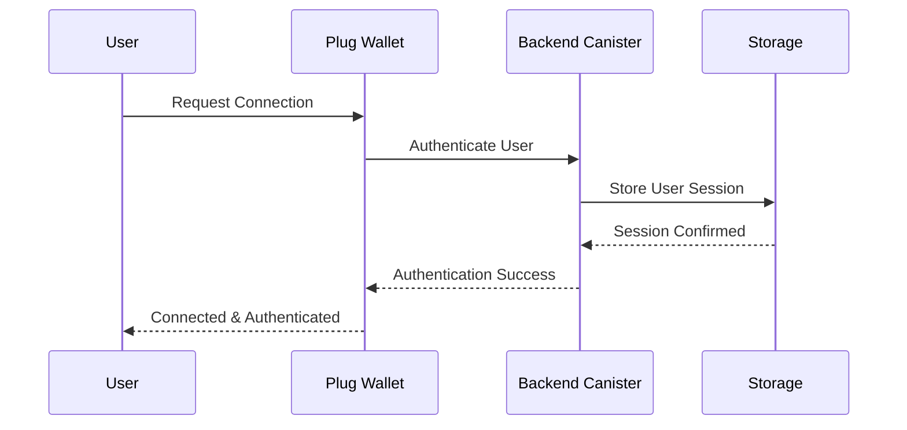
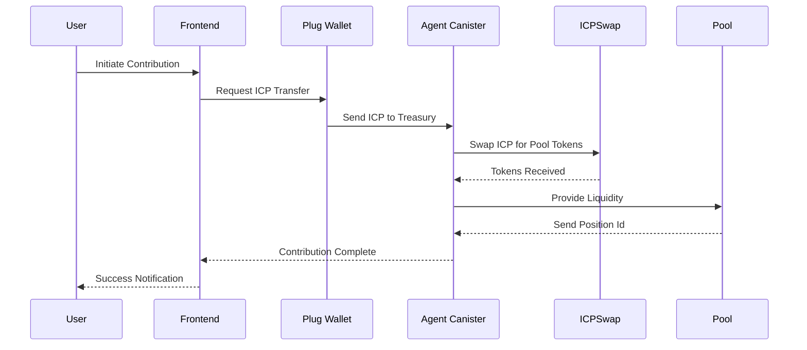
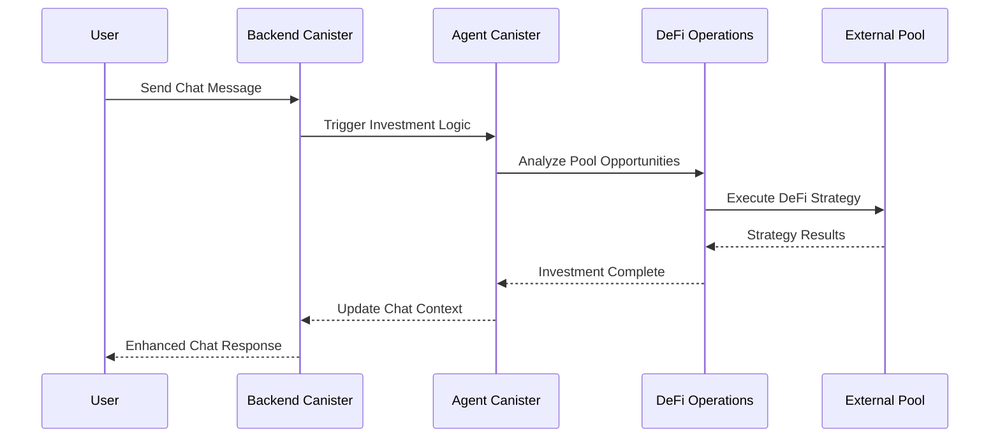
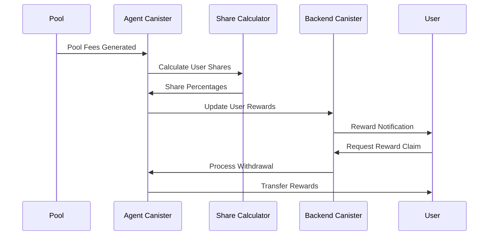

# OPTIC

[](https://internetcomputer.org/)
[](https://www.typescriptlang.org/)
[](https://reactjs.org/)
[ ensures alignment
- **Transparent calculation** shown before each withdrawal

### 🤖 Premium AI Features

- **Freemium model** for basic AI insights
- **Subscription tiers** for advanced analytics and predictions
- **Pay-per-query** option for occasional users

### 🔮 Future Revenue Streams

- **Premium room features** (advanced analytics, custom branding)
- **Enterprise solutions** for organizations and DAOs
- **Third-party integrations** and API access
- **NFT marketplace** for room achievements and badges

*All fees are transparent, competitive, and designed to sustain long-term platform development while maximizing user value.*green)](https://demergent-labs.github.io/azle/)
[](https://internetcomputer.org/docs/current/motoko/main/motoko)

> **A fully on-chain chat application that redefines what Web3 messaging should look like - built on the Internet Computer blockchain.**

**OPTIC** combines decentralized messaging with automated DeFi strategies, allowing users to turn their chat rooms into collaborative investment pools. Every message sent contributes to a shared treasury that generates passive income for all participants through intelligent liquidity provision on ICPSwap.

## ✨ Key Features

- **🔒 Fully Decentralized**: No central servers - everything runs on-chain
- **💰 Earn While You Chat**: Convert chat rooms into investment pools
- **🤖 AI-Powered Analytics**: Built-in AI agent for investment insights
- **🔄 Automated DeFi**: Intelligent liquidity provision on ICPSwap v3
- **💎 Chain-Key Tokens**: Support for ICP, ckUSDC, ckETH, ckBTC, and more
- **📱 Modern UI**: Clean, responsive interface with real-time messaging
- **🏆 Reward System**: Earn fees proportional to your contributions

## Table of Contents

- [✨ Key Features](#-key-features)
- [🌐 The Web3 Way](#-the-web3-way)
- [🚀 Additional Features](#-additional-features)
- [🏗️ Canister Topology & Architecture](#️-canister-topology--architecture)
  - [Optic Backend Canister](#optic-backend-canister)
  - [Optic Agent Canister](#optic-agent-canister)
  - [Architecture](#architecture)
- [⚡ Quick Start](#-quick-start)
  - [Prerequisites](#prerequisites)
  - [Installation](#installation)
  - [Development](#development)
  - [Troubleshooting](#troubleshooting)
- [💰 Revenue Model](#-revenue-model)
- [🔄 Limitations and Improvements](#-limitations-and-improvements)
- [🤝 Contributing](#-contributing)
- [📄 License](#-license)

## 🌐 The Web3 Way

**OPTIC** is a paradigm shift in how we think about messaging applications. Instead of extracting value from users' data and attention, we **create value** for every interaction.

### How It Works

1. **💬 Chat Naturally**: Join or create chat rooms just like any messaging app
2. **💰 Contribute to Pool**: Members contribute ICP/ckUSDC to the room's investment treasury
3. **🤖 AI Agent Invests**: Our smart agent analyzes ICPSwap pools and executes optimal strategies
4. **📈 Earn Passive Income**: Collect fees from liquidity provision proportional to your contribution
5. **🔄 Withdraw Anytime**: Leave with your principal + accumulated rewards

### Technical Implementation

Our platform leverages the Internet Computer's unique capabilities to deliver:

- **🔐 True Decentralization**: All data stored on-chain, no centralized servers
- **⚡ Near Real-time**: IC's 2-second finality enables smooth chat experiences
- **🔄 Automated DeFi**: Smart contracts handle all investment operations
- **💎 Chain-Key Integration**: Seamless interaction with Bitcoin, Ethereum tokens
- **🏦 Transparent Treasury**: All fund movements are auditable on-chain

## 🚀 Additional Features

Beyond making DeFi as simple as sending a message, **OPTIC** includes powerful features that enhance the Web3 experience:

### 💳 Integrated Wallet Dashboard

- **Multi-Token Support**: Manage ICP, ckBTC, ckETH, ckUSDC, and more
- **Real-time Balances**: Live token price feeds and portfolio tracking
- **Transaction History**: Complete on-chain transaction explorer
- **Secure Integration**: Seamless Plug Wallet connectivity

### 🤖 AI-Powered Insights

- **Smart Notifications**: AI-generated summaries of pool performance
- **Investment Analytics**: Automated analysis of DeFi opportunities
- **Risk Assessment**: Real-time evaluation of liquidity pool risks
- **Personalized Reports**: Customized insights based on your investment style

### 🏆 Gamification & Rewards

- **Contribution Leaderboards**: Recognition for top pool contributors
- **Achievement System**: Unlock badges for milestones and activities
- **Referral Rewards**: Earn bonuses for bringing new users to rooms
- **Social Trading**: Follow successful room strategies

### 🔐 Enterprise-Grade Security

- **Multi-Signature Support**: Enhanced security for high-value rooms
- **Audit Trail**: Complete transparency of all fund movements
- **Emergency Procedures**: Built-in safeguards and recovery mechanisms

## 🏗️ Canister Topology & Architecture

**OPTIC** uses a sophisticated multi-canister microservices architecture designed for scalability, security, and maintainability. This separation of concerns allows us to optimize each component for its specific role while maintaining secure inter-canister communication.

### Optic Backend Canister

**Primary Role**: CRUD Operations & Data Management

- **🔐 Authentication**: User identity management using Internet Identity
- **💬 Chat Management**: Real-time messaging, room administration, and history
- **👥 User Management**: Profiles, preferences, and social features
- **🗄️ Persistent Storage**: Optimized data structures for chat and user data
- **🔧 Technology**: Built with [Azle](https://demergent-labs.github.io/azle/) (TypeScript for IC)
- **🌐 Deployment**: [View on IC Dashboard](https://dashboard.internetcomputer.org/)

```typescript
// Example: Chat message handling
export const sendMessage = update(
  [text, principal],
  text,
  (content, roomId) => {
    // Validate user permissions
    // Store message with timestamp
    // Notify room participants
    // Return message ID
  }
);
```

### Optic Agent Canister

**Primary Role**: DeFi Operations & Treasury Management

- **💰 Treasury Management**: Secure handling of user contributions
- **📊 Pool Analysis**: Real-time evaluation of ICPSwap opportunities
- **🔄 Automated Trading**: Smart contract-based token swapping
- **🏦 Liquidity Provision**: Automated LP position management
- **💎 Reward Distribution**: Proportional fee allocation to contributors
- **🔧 Technology**: Built with [Motoko](https://internetcomputer.org/docs/current/motoko/main/motoko) (IC's native language)
- **🌐 Deployment**: [View on IC Dashboard](https://dashboard.internetcomputer.org/)

```motoko
// Example: Liquidity provision logic
public func provideLiquidity(amount: Nat, poolId: Text) : async Result<Text, Text> {
  // Validate pool parameters
  // Execute token swaps for optimal ratio
  // Provide liquidity to ICPSwap
  // Record position and shares
};
```

### Architecture

Optic follows a **multi-canister microservices architecture** designed for scalability, security, and maintainability. The system is built on the Internet Computer blockchain with two main canisters that work together to provide a seamless DeFi-enabled chat experience.



#### **System Components**

**🔹 Frontend Layer**

- **React Application**: Modern UI built with React, TypeScript, and Tailwind CSS
- **Plug Wallet Integration**: Secure wallet connection and transaction signing
- **Real-time Chat Interface**: Messaging system with near realtime capabilities, thanks to Tanstack Query

**🔹 Backend Canister (Azle)**

- **Authentication & Authorization**: User identity management and session handling
- **Chat Management**: Room creation, message handling, and group administration
- **User Management**: Profile management, preferences, and user data
- **Data Storage**: Persistent storage for chat history, user data, and metadata

**🔹 Agent Canister (Motoko)**

- **DeFi Operations**: Automated investment strategies and pool analysis
- **Token Swapping**: Integration with ICPSwap for token exchanges
- **Liquidity Management**: Pool participation and liquidity provision
- **Treasury Management**: Fund allocation, fee collection, and reward distribution

**🔹 External Integrations**

- **ICPSwap v3**: Decentralized exchange for token trading
- **ICP Ledger**: Native ICP token transactions
- **ckUSDC Ledger**: Chain-key USDC token operations

#### **Data Flow Architecture**

1. **User Authentication Flow**



2. **Contribution Flow**



3. **Chat & Investment Integration**



4. **Reward Distribution Flow**



#### **Security Architecture**

- **Canister Isolation**: Separate canisters for different concerns
- **Cross-Canister Authentication**: Secure communication between canisters
- **Wallet Integration**: User-controlled private keys via Plug wallet
- **On-Chain Verification**: All transactions verified on the IC blockchain

#### **Scalability Features**

- **Modular Design**: Independent canisters can be upgraded separately
- **Horizontal Scaling**: Multiple canister instances for high load
- **Efficient Storage**: Optimized data structures for chat and financial data
- **Caching Layer**: In-memory caching for frequently accessed data

## ⚡ Quick Start

Get **OPTIC** running locally in just a few minutes!

### Prerequisites

Before you begin, ensure you have the following installed:

- **Node.js** (v20 or higher) - [Download here](https://nodejs.org/)
- **DFX SDK** (Internet Computer SDK) - [Installation Guide](https://internetcomputer.org/docs/building-apps/getting-started/install)
- **pnpm** (Package manager) - Install with `npm install -g pnpm`
- **Plug Wallet** (Browser extension) - [Install from here](https://plugwallet.ooo/)

### Installation

1. **Clone the repository**

```bash
# Fork and clone your own copy
git clone https://github.com/<YOUR_USERNAME>/optic.git

# Or clone directly from main repository
git clone https://github.com/divin3circle/optic.git

cd optic
```

2. **Install dependencies**

```bash
# Install root dependencies
pnpm install

# Install frontend dependencies
cd src/frontend && pnpm install && cd ../..
```

### Development

3. **Start the Internet Computer replica**

```bash
# Start IC replica in background
dfx start --clean --background

# Verify it's running
dfx ping
```

4. **Deploy canisters locally**

```bash
# Deploy backend canister
dfx deploy backend

# Deploy frontend canister
dfx deploy frontend

# Or deploy all at once
dfx deploy
```

5. **Start the development server**

```bash
# Navigate to frontend and start dev server
cd src/frontend
pnpm run dev
```

6. **Set up the Agent Canister**

The agent canister requires special setup. Follow the detailed guide at:
👉 **[Optic Agent Setup](https://github.com/divin3circle/optic_agent)**

```bash
# Note: Agent canister should be deployed on the playground
# to avoid cross-subnet call errors
```

### Troubleshooting

**🔧 Common Issues & Solutions**

**Problem**: `dfx start` fails with port errors

```bash
# Solution: Kill existing processes and restart
sudo lsof -ti:4943 | xargs kill -9
dfx start --clean --background
```

**Problem**: Frontend can't connect to backend

```bash
# Solution: Regenerate canister declarations
dfx generate backend
cd src/frontend && pnpm run dev
```

**Problem**: Plug Wallet connection issues

- Ensure you're on the correct network (Local/Mainnet)
- Clear browser cache and reconnect wallet
- Check that canisters are deployed and running

**Problem**: Build failures

```bash
# Solution: Clean and reinstall dependencies
rm -rf node_modules src/frontend/node_modules
pnpm install
cd src/frontend && pnpm install
```

**Need help?** Open an issue on [GitHub](https://github.com/divin3circle/optic/issues) with:

- Operating system and versions
- Full error messages
- Steps to reproduce the problem

## Revenue

Our platform will have a couple of ways to generate revenue:

- Each chat room creation will cost a small fee and part of it will be used to fund the chat room’s canister with cycles.
- After every withdrawal from the pool the platform will charge a service fee based on the earnings.
- User specific agent will be charged on a prompt basis or via a freemium model.

## 🔄 Limitations and Improvements

**OPTIC** is actively evolving. Here are current limitations and our roadmap for addressing them:

### 🚧 Current Limitations

**1. Centralized Treasury Model**

- **Issue**: All funds currently route to a single treasury canister
- **Impact**: Limited scalability and increased risk concentration
- **Roadmap**: Individual canister per chat room with dedicated treasury

**2. Fixed Room Parameters**

- **Issue**: Room settings are immutable after creation
- **Impact**: No flexibility for changing investment strategies
- **Roadmap**: DAO-like governance system for parameter updates via proposals

**3. Limited Token Support**

- **Issue**: Currently supports only ICP/ckUSDC pool
- **Impact**: Reduced diversification options for users
- **Roadmap**: Multi-token contributions and diversified pool strategies

**4. No User Verification**

- **Issue**: Anonymous users may create spam or abuse systems
- **Impact**: Potential security and compliance concerns
- **Roadmap**: Optional KYC with mobile OTP verification

### 🚀 Planned Improvements

**Phase 1: Decentralized Architecture**

- Individual canister per chat room
- Isolated treasury management
- Cross-canister communication protocols

**Phase 2: Advanced DeFi Features**

- Multi-pool investment strategies
- Yield farming optimization
- Cross-chain liquidity provision

**Phase 3: Governance & DAO Features**

- Community-driven room management
- Proposal-based parameter updates
- Decentralized dispute resolution

**Phase 4: Enterprise & Compliance**

- Optional KYC/AML integration
- Institutional treasury management
- Regulatory compliance tools

### 💡 Community Contributions Welcome

We actively encourage community contributions! Areas where you can help:

- **🐛 Bug Reports**: Found an issue? [Report it here](https://github.com/divin3circle/optic/issues)
- **💻 Code Contributions**: Check our [good first issues](https://github.com/divin3circle/optic/labels/good%20first%20issue)
- **📚 Documentation**: Help improve guides and tutorials
- **🎨 UI/UX**: Design improvements and accessibility enhancements
- **🧪 Testing**: Help us test new features and report feedback

---

**OPTIC** represents a unique approach to Web3 messaging on the Internet Computer. By seamlessly bridging social interaction with DeFi opportunities, we're making blockchain adoption intuitive and rewarding for everyday users.

## 🤝 Contributing

We welcome contributions from developers, designers, researchers, and users! **OPTIC** is built by the community, for the community.

### Ways to Contribute

**🔧 Development**

- Check out [open issues](https://github.com/divin3circle/optic/issues)
- Look for issues labeled [`good first issue`](https://github.com/divin3circle/optic/labels/good%20first%20issue)
- Submit bug fixes and feature implementations

**📝 Documentation**

- Improve README and setup guides
- Write tutorials and how-to guides
- Translate documentation to other languages

**🎨 Design & UX**

- UI/UX improvements and mockups
- Accessibility enhancements
- Mobile responsiveness improvements

**🧪 Testing & Feedback**

- Test new features and report bugs
- Provide user experience feedback
- Performance testing and optimization

### Development Workflow

1. **Fork** the repository
2. **Create** a feature branch (`git checkout -b feature/amazing-feature`)
3. **Make** your changes following our coding standards
4. **Test** your changes thoroughly
5. **Commit** your changes (`git commit -m 'Add amazing feature'`)
6. **Push** to your branch (`git push origin feature/amazing-feature`)
7. **Open** a Pull Request with detailed description

### Code Standards

- **TypeScript**: Use strict typing and follow existing patterns
- **Formatting**: Run `pnpm format` before committing
- **Testing**: Include tests for new functionality
- **Documentation**: Update docs for public API changes

### Community Guidelines

- Be respectful and inclusive to all contributors
- Follow our [Code of Conduct](CODE_OF_CONDUCT.md)
- Help others learn and grow in the Web3 space
- Provide constructive feedback on issues and PRs

**Questions?** Join our [Discord community](https://discord.gg/optic) or [open a discussion](https://github.com/divin3circle/optic/discussions).

## 📄 License

This project is licensed under the **MIT License** - see the [LICENSE](LICENSE) file for details.

### What this means:

- ✅ **Free to use** for personal and commercial projects
- ✅ **Modify and distribute** the code freely
- ✅ **Private use** allowed
- ⚠️ **No warranty** - use at your own risk
- ℹ️ **Attribution required** - include original license

---

<div align="center">

**Built with ❤️ on the [Internet Computer](https://internetcomputer.org/)**

</div>
