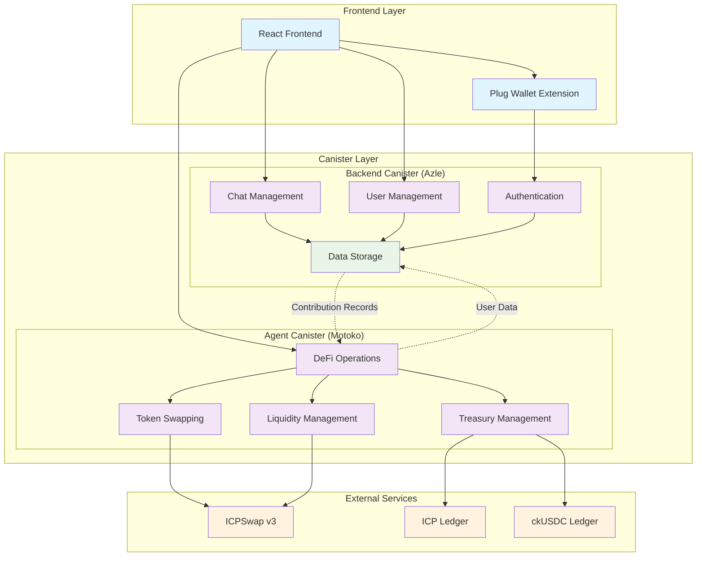
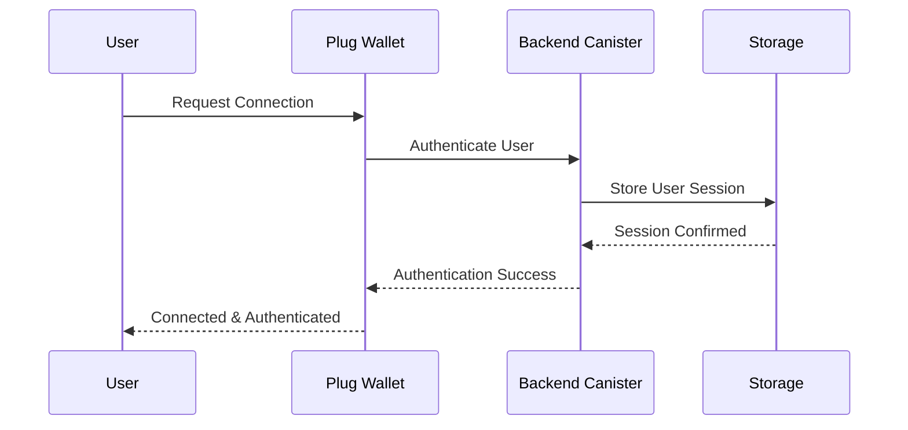
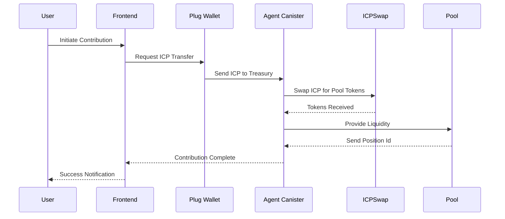
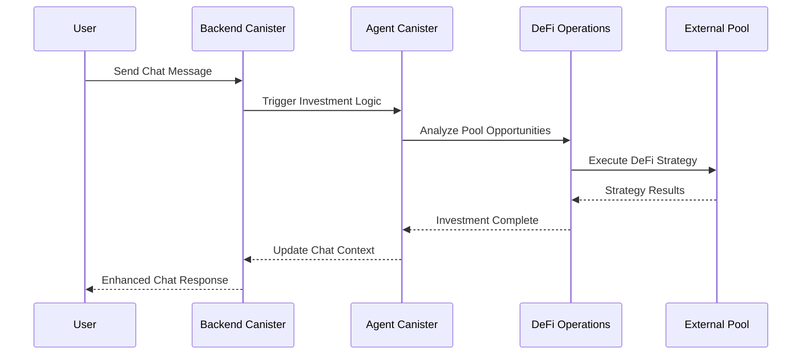
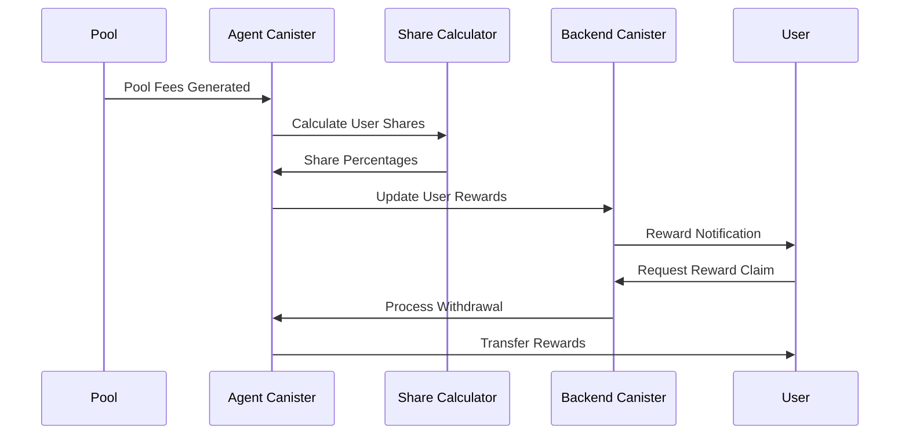

# OPTIC

We are proposing a fully on-chain chat application that embodies what chat rooms in web3 are suppose to look like built on the self-writing internet.

## Table of Contents

- [The Web3 Way](#the-web3-way)
- [Additional Features](#additional-features)
- [Canister Topology & Architecture](#canister-topology--architecture)
  - [Optic Backend Canister](#optic-backend-canister)
  - [Optic Agent Canister](#optic-agent-canister)
  - [Architecture](#architecture)
- [Local Setup](#local-setup)
  - [Prerequisites](#prerequisites)
- [Revenue](#revenue)
- [Limitations and Improvements](#limitations-and-improvements)

## The Web3 Way

Optics is a chat and messaging application that allows users to go interact with each other in a decentralized and secure manner, while still earning from their interactions. Using our platform users can convert their local chat room into a decentralized investment pool accepting interval contributions from members. All the contributions are routes to the agent canister which integrates ICPSwapv3 to:

- Get top pools from ICPSwap and evaluate the tokens needed
- Swaps a relevant amount of the desired tokens in the chosen pools
- Provides liquidity to the desired pool

All member contributions are recorded on the main storage canister and each member is allocated a share percentage the total rewards earned from fees in the pool the agent invested in. This share is relative to the amount the user contributed and the total amount invested in the pool by the agent. Additionally we use this share to calculate how much in rewards the user can claim.

The user can request to claim their rewards at any time. Leaving a chat room is the same as withdrawing all the contributions you have made on the said room plus the total amount of uncollected fees. This action reduces a user's share as well.

## Additional Features

Apart from making DeFi as easy as making a contribution, Optic also has other features that we believe adds value to the ICP ecosystem and improve blockchain adoption as well. These include:

- Clean wallet UI and Dashboard that enables users manage their chain-key tokens
- AI Debriefing agent built into the notifications system of the user for summary provision

## Canister Topology & Architecture

As discussed before, Optic opted for a multi canister approach in order to sepparate the CRUD part of the application with the business login. Our dApp utilizes 2 canisters that communicate and sync with each other to deliver value to the user.

### Optic Backend Canister

This is the canister in charge of all the CRUD and authentication functions. It's written in [Azle]() and also serves as the storage canister. Deployed [here]().
Mainnet canister id:

### Optic Agent Canister

The Optic agent canister houses the business logic of our platform. This is the main canister that handles users' funds, analyzes available pools on ICPSwap, performs swaps to get the right tokens for liquidity provision, collects fees once requested. Works closey with the backend canister for actions such as contribution, share calculations etc.
It's written in ICP's native language [Motoko]() and main net canister is:
Deployed [here]().

### Architecture

Optic follows a **multi-canister microservices architecture** designed for scalability, security, and maintainability. The system is built on the Internet Computer blockchain with two main canisters that work together to provide a seamless DeFi-enabled chat experience.



#### **System Components**

**🔹 Frontend Layer**

- **React Application**: Modern UI built with React, TypeScript, and Tailwind CSS
- **Plug Wallet Integration**: Secure wallet connection and transaction signing
- **Real-time Chat Interface**: Messaging system with near realtime capabilities, thanks to Tanstack Query

**🔹 Backend Canister (Azle)**

- **Authentication & Authorization**: User identity management and session handling
- **Chat Management**: Room creation, message handling, and group administration
- **User Management**: Profile management, preferences, and user data
- **Data Storage**: Persistent storage for chat history, user data, and metadata

**🔹 Agent Canister (Motoko)**

- **DeFi Operations**: Automated investment strategies and pool analysis
- **Token Swapping**: Integration with ICPSwap for token exchanges
- **Liquidity Management**: Pool participation and liquidity provision
- **Treasury Management**: Fund allocation, fee collection, and reward distribution

**🔹 External Integrations**

- **ICPSwap v3**: Decentralized exchange for token trading
- **ICP Ledger**: Native ICP token transactions
- **ckUSDC Ledger**: Chain-key USDC token operations

#### **Data Flow Architecture**

1. **User Authentication Flow**



2. **Contribution Flow**



3. **Chat & Investment Integration**



4. **Reward Distribution Flow**



#### **Security Architecture**

- **Canister Isolation**: Separate canisters for different concerns
- **Cross-Canister Authentication**: Secure communication between canisters
- **Wallet Integration**: User-controlled private keys via Plug wallet
- **On-Chain Verification**: All transactions verified on the IC blockchain

#### **Scalability Features**

- **Modular Design**: Independent canisters can be upgraded separately
- **Horizontal Scaling**: Multiple canister instances for high load
- **Efficient Storage**: Optimized data structures for chat and financial data
- **Caching Layer**: In-memory caching for frequently accessed data

## Local Setup

### Prerequisites

- Nodejs at least version 20
- IC SDK installed. [Installation Guide](https://internetcomputer.org/docs/building-apps/getting-started/install)
- Plug wallet extension installed, [Guide](https://plugwallet.ooo/)

1. Fork and clone this repository

```bash
git clone https://github.com/<YOUR_USERNAME>/optic.git
# or alternatively clone it directly
git clone https://github.com/divin3circle/optic.git
```

2. Install dependencies

```bash
cd optic && pnpm install
# advisable to also install dependencies from the frontend dir
cd src/frontend && pnpm install
```

3. Deploy the canisters locally and run the development server

```bash
# at the project root run
dfx start --clean --background
dfx deploy && cd src/frontend
pnpm run dev
```

4. Follow guide [here](https://github.com/divin3circle/optic_agent) to set up Optic agent

```bash
# optic agent needs to be deployed on the playground to avoid cross subnet calls errors
```

## Revenue

Our platform will have a couple of ways to generate revenue:

- Each chat room creation will cost a small fee and part of it will be used to fund the chat room’s canister with cycles.
- After every withdrawal from the pool the platform will charge a service fee based on the earnings.
- User specific agent will be charged on a prompt basis or via a freemium model.

## Limitations and Improvements

1. All funds are currently being routed to a single treasury canister, each chat room needs to be canister on it's own, and handle it's funds, this includes swapping, liquidity provision, fee collection etc.
1. Parameters of a room are set in stone. Members of a chat room need to have a DAO like relationship where a proposal can be made to update the chat room's settings.
1. No user verification done, for KYC. Need to implement an OTP via mobile number for verification.
1. Currently only one pool is supported(ICP/ckUSDC) and users can only contribute using the said tokens. Allow multi-token contribution to diversify pool investment.

Optic offers a uniques angle for users on the ICP network. By bridging the DeFi gap using a fully on-chain social messaging up, we're making blockchain adoption and usage intuitive.
